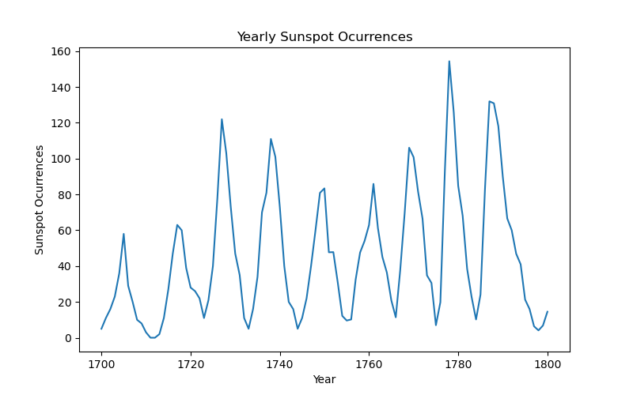
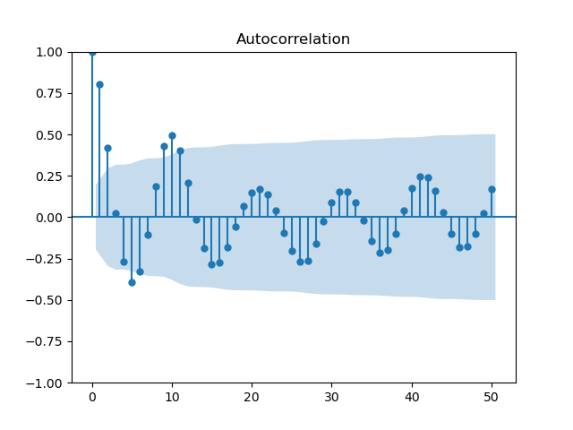

*Dimitrije Stankovic (Aug 2024)*

# Prelude to Traditional Forecasting Methods

This first entry on forecasting will cover some statistical requirements for for forecasting time series data correctly. I assume some basic [high-school statistics](https://www.openintro.org/book/os/) and some basic knowledge of [Python programming](https://wesmckinney.com/book/), but the rest will be explained as we go. 

I will refer to Diez et al., *OpenIntro Statistics*, 4th ed. as *"OS"*, so that any of the basics are easily accessible to you. I will also refer to Stock & Watson, *Introduction to Econometrics*, 4th ed. occasionally as *"SW"*. This book is a very reasonable \$239.99 in hardcover (or \$165.32 paperback) from Pearson, unless perhaps a version of it appears after searching `stock and watson pdf` on Google. Though, of course, one must always purchase textbooks from authorised sources.

When conducting time-series regression there are a few assumptions we need to confirm about the data. These are: stationarity, mixing, invertibility, and finite kurtosis. We'll take each of these in turn.

## Stationarity

Stationarity just means that future values of the target variable share the same statistical properties as past values. Generally we are only looking for *weak* stationarity, which is defined by the following properties:

- Constant Mean: $\forall_t [E(Y_t) = \mu]\ $ s.t.
  - $\text{E}(Y_t)$ is the expected value of the stochastic process $Y$ at time $t$ [OS 3.4.1]
  - and $\mu$ is the parametric mean (the mean to which $\text{E}(Y_t)$ converges) of the time series process [OS 2.1.2]
- Constant Variance: $\forall_t [\text{Var}(Y_t) = \sigma^2]\ $ s.t.
  - $\text{Var}[Y_t]$ is the variance of the stochastic process $Y$ at time $t$ [OS 3.4.2]
  - and $\sigma^2$ is the parametric variance of the time series process [ibid.]
- Constant Autocovariance: $\forall_t [\text{Cov}(Y_t, Y_{t-h}) = \gamma(h)]\ $ s.t.
  - $\text{Cov}(Y_t, Y_{t-h})$ is the j-th autocovariance of the stochastic process $Y$ [SW, KC 15.2]
  - and $\gamma(h)$ is the parametric autocovariance function which depends **only** on $h$

Without getting too into the weeds with this stuff (but if you want to know more, see: [SW 15.7]), we can test for weak stationarity by running an Augmented Dickey-Fuller (ADF) test. In Python this looks like:

```python
"""
Importing data
"""
%pip install pydataset
from pydataset import data

import pandas as pd
import numpy as np

df = data('sunspot.year')[df['time'] <= 1800]
 # From the documentation
```

```python
"""
Plotting the data
"""
import matplotlib as mpl
import matplotlib.pyplot as plt

plt.figure(figsize=(8,5))

plt.plot(df['time'], df['sunspot.year'])

plt.xlabel('Year')
plt.ylabel('Sunspot Ocurrences')
plt.title('Yearly Sunspot Ocurrences')

plt.show
```



```python
"""
Running the ADF
"""
import statsmodels.api as sm
from statsmodels.tsa.stattools import adfuller

print(f"ADF Statistic: {adfuller(df['sunspot.year'])[0]}, ADF p-value: {adfuller(df['sunspot.year'])[1]}")
```

`ADF Statistic: -6.816175645042357, ADF p-value: 2.056481561970274e-09` 

The p-value is very significant [OS 5.3.4], so we know that the series is stationary. If the series is not stationary, there are some key reasons for this that we can deal with: trends and seasonality. Trends are really easy to deal with, just difference the data to detrend, meaning that instead of modelling

$$
[Y_t,\ Y_{t+1},\ ...\ ,\ Y_T]
$$

we want to model


$$
[(Y_{t+1}-Y_t),\ (Y_{t+2}-Y_{t+1}),\ ...\ ,\ (Y_T - Y_{T-1})]
$$

This ensures that the trend is removed (or reduced) from the time series.

Seasonality is also reduced by differencing but there is a more sophisticated way to do this, as we'll see later in this series on forecasting.

## Mixing

This requirement can be expressed in terms of the autocovariance function that we talked about earlier: mixing is the convergence of $\gamma(h)$ to 0 as $h$ increases. Although, autocovariance is not a particularly human-readable statistic, so we can use autocorrelation to better understand mixing (and consequently stationarity), since:

$$
\text{Corr}(Y_t, Y_{t-h}) = \frac{\text{Cov}(Y_t, Y_{t-h})}{\sqrt{\text{Var}(Y_t)\text{Var}(Y_{t-h})}}
$$

The parametric form of $\text{Corr}(Y_t, Y_{t-h})$ can be written as $\rho_h$, such that mixing is satisfied when $\rho_h$ converges to 0 as $h$ increases.

The way to test for this is to plot the autocorrelation function (ACF) and check whether the value decreases over time.

Continuing our sunspot example, the ACF is plotted like this:

```python
sm.graphics.tsa.plot_acf(df['sunspot.year'], lags=30)
plt.show()
```



We see that the lags are generally not significant (the shaded area is a 95% confidence interval for $\text{H}_0: \rho_h = 0\ $ [OS 5.3.1]) after lag 2, so mixing is satisfied.

## Invertibility

The formal definition for invertibility can be quite complex, but the way it tends to be explained in econometrics textbooks is that there should be no perfect multicollinearity in the features (or lags). To quote this wording from Stock and Watson [6.5]:

> The regressors are said to exhibit **perfect multicollinearity** (or to be perfectly multicollinear) if one of the regressors is a perfect linear function of the other regressors."

This is the clearest presentation of the requirement I have seen, but an example might help to explain *why* this is a requirement. Say you want one of your regressors for a predictive model of rainfall to be temperature -- you **cannot** use the temperature in Celsius as one regressor **and** Fahrenheit as another. The reason for this is that: $x \degree C = (32 + 1.8 x) \degree F$, which means that Fahrenheit is a linear function of Celsius and vice-versa. This doesn't work because you are asking the model to quantify the effect of temperature on the underlying process, while controlling for temperature (but this time at a different scale).

In practice, you will never have to test for invertibility yourself, since most statistical packages will refuse to attempt a regression if this requirement is not met, and others will complain loudly.

## Finite Kurtosis

Kurtosis describes the 'heaviness' of tails in the distribution of residuals. Basically, we are trying to determine how well-behaved or wild the residuals in a fitted model are. To check kurtosis for a fitted model, we will have to fit a model first. Since, this is the topic of the next installment of this series on forecasting, I will briefly fit an autoregressive (AR) model to the sunspot data so that we can examine the kurtosis:

```python
from statsmodels.tsa.ar_model import AutoReg
import scipy.stats as stats

model = AutoReg(df['sunspot.year'], lags=2)
results = model.fit()

residuals = results.resid

print(stats.kurtosis(residuals))
```

`1.275451125028427`

which is definitely finite. In fact, this is very good! We can call these residuals *platykurtic*, since the value is lower than 3 (the kurtosis of a normal distribution), which implies a very well behaved model.

For fun, we can also take a look at the plot of this model:

```python
fitted_values = results.fittedvalues

plt.figure(figsize=(8, 5))

plt.plot(df['time'][2:], df['sunspot.year'][2:], label='Actual', color='blue')
plt.plot(df['time'][2:],fitted_values, label='Predicted', color='orange')

plt.title('AR(2) Model Fit of Sunspot Ocurrences')
plt.xlabel('Year')
plt.ylabel('Sunspot Ocurrences')
plt.legend()
```


